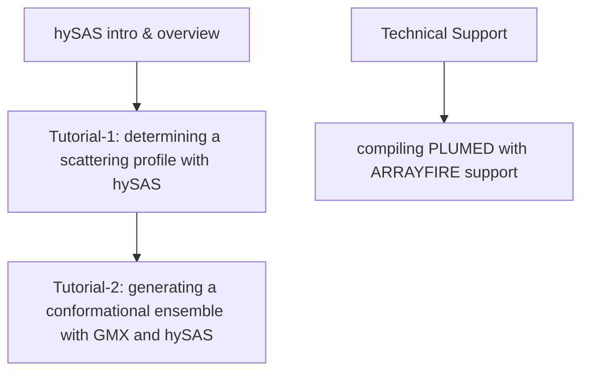

```mermaid
flowchart TB
  A[hySAS intro & overview]
  A --> B[Tutorial-1: determining a scattering profile with hySAS]
  B --> C[Tutorial-2: generating a conformational ensemble with GMX and hySAS]

  D[Technical Support]
  D --> E[compiling PLUMED with ARRAYFIRE support]
  
  click B "https://github.com/federicoballabio/sas-tutorial/blob/main/01.md" "Tutorial-1: determining a scattering profile with hySAS"
  click C "https://github.com/federicoballabio/sas-tutorial/blob/main/02.md" "Tutorial-2: generating a conformational ensemble with GMX and hySAS"
  click E "https://github.com/federicoballabio/sas-tutorial/blob/main/arrayfire.md" "compiling PLUMED with ARRAYFIRE support"
```