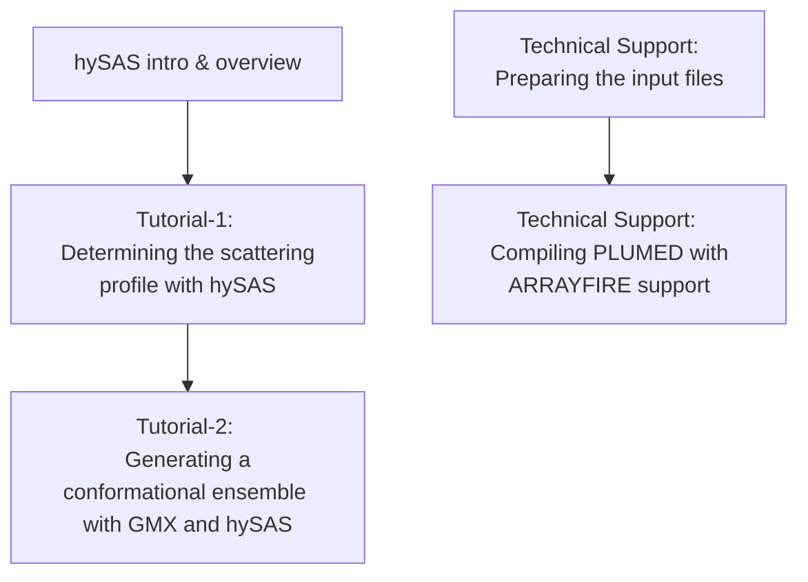

```mermaid
flowchart TB
  A[hySAS intro & overview]
  A --> B[Tutorial-1: <br> Determining the scattering profile with hySAS]
  B --> C[Tutorial-2: <br> Generating a conformational ensemble with GMX and hySAS]

  D[Technical Support: <br> Preparing the input files]
  D --> E[Technical Support: <br> Compiling PLUMED with ARRAYFIRE support]
  
  click A "intro.md" "hySAS intro & overview"
  click B "01.md" "Tutorial-1: Determining the scattering profile with hySAS"
  click C "02.md" "Tutorial-2: Generating a conformational ensemble with GMX and hySAS"
  click D "input.md" "Preparing the input files"
  click E "arrayfire.md" "Compiling PLUMED with ARRAYFIRE support"
```